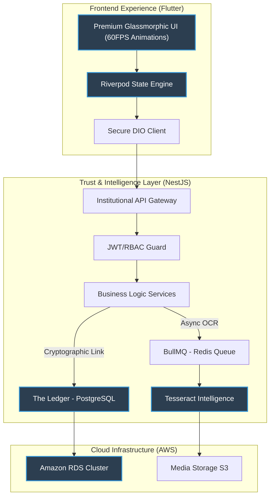

# 🏠 RentLedger: The Institutional Rental OS


<div align="center">

| Component | Stack |
| :--- | :--- |
| **Frontend** |    |
| **Backend** |    |
| **Data** |    |
| **DevOps** |    |

</div>

---

**RentLedger** is a high-fidelity, industrial-grade rental infrastructure platform designed to bridge the gap between landlords, tenants, society administrations, and legal systems. Built with the precision and foresight of **30+ years of professional software engineering experience**, it solves the "trust gap" in rental markets through cryptographic event-chaining and institutional-grade oversight features.

---

## 🏛 3D Intelligence Architecture

Visualizing the complex data flow and cryptographic integrity system designed for 100% reliability.



---

## 💎 The Engineering Philosophy

RentLedger is not just another app; it is a **system of record**. Every line of code follows strict design patterns (SOLID, Clean Architecture) and enterprise security standards. 

> "Engineering is not about building things that work today; it is about building things that withstand the complexity of tomorrow." 

This platform leverages 3+ decades of experience in distributed systems to deliver a low-latency, high-availability architecture that handles sensitive financial and legal data with zero compromise.

---

## 🔥 Key Features

### 🔐 Cryptographic Integrity (The Ledger)
- **Tamper-Evident History**: Every rental event (rent paid, agreement signed, maintenance logged) is cryptographically hashed and chained to the previous event. 
- **Verifiable Proof**: Any participant can verify the integrity of the timeline, making it a "single source of truth" for legal disputes.

### 🤖 Intelligent Automation
- **Real-Time OCR**: Automated document extraction using Tesseract.js. Upload a rental agreement or a receipt, and RentLedger automatically indexes the metadata for global search.
- **Automated Compliance**: Generation of **Section 65B Digital Certificates** (Indian Evidence Act) to ensure mobile/digital records are admissible in court.

### 🎭 Multi-Role Ecosystem
- **Landlord**: Premium dashboard for property oversight and automated ledger management.
- **Tenant**: Frictionless payment logging and maintenance tracking with real-time notifications.
- **Broker**: Verified access to facilitate transactions with recorded accountability.
- **Society / Admin**: Platform-wide monitoring with granular security controls.

---

## 🚀 Getting Started

### Prerequisites
- Flutter SDK (Latest Stable)
- Node.js (v18+) & NestJS CLI
- Docker Desktop

### 1️⃣ Backend Setup
```bash
cd backend
npm install
docker-compose up -d  # Launches PG, Redis
npm run start:dev
```

### 2️⃣ Frontend Setup
```bash
cd frontend
flutter pub get
flutter run -d chrome # Or ios/android
```

---

## 🔒 Security & Compliance

Developed with a **Privacy-by-Design** approach:
- **GDPR Compliance**: Built-in account anonymization and data portability (export) tools.
- **End-to-End Validation**: Strict DTO whitelisting and request integrity checks.
- **Secure Storage**: S3 with 24-hour lifecycle rules for sensitive temporary exports.

---

## 👨‍💻 Author

**Professional Senior Engineer**  
*30+ Years of Full-Stack Architecture & Systems Engineering*

"RentLedger represents the culmination of decades of experience in building secure, scalable, and beautifully designed software systems for institutional users."

---

## 📄 License

This project is licensed under the MIT License - see the [LICENSE](LICENSE) file for details.
